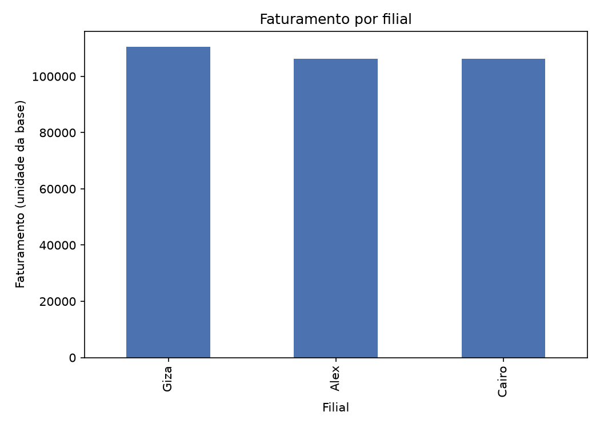
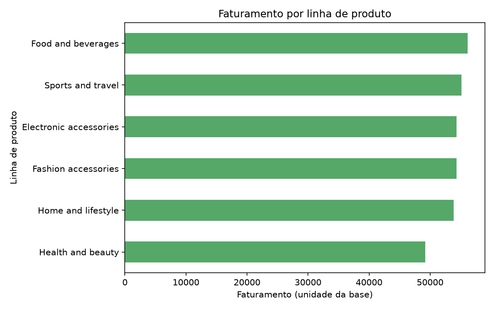
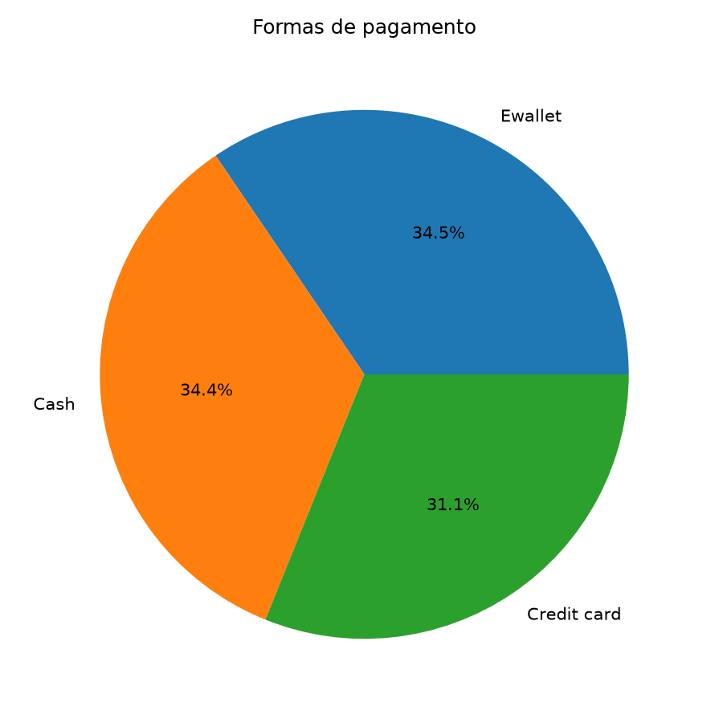
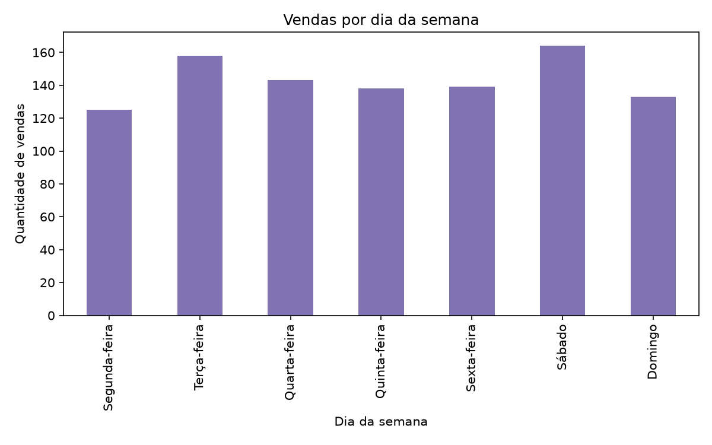

# Análise de dados com Python e SQL — Supermarket Sales

Este projeto reúne a leitura, o tratamento e a análise de uma base de vendas de supermercado, buscando responder perguntas sobre filiais, produtos e formas de pagamento.

Utilizei essa base para praticar a leitura de arquivos, as consultas SQL, o tratamento com Pandas e a análise dos resultados. A ideia foi acompanhar os dados desde o CSV original até as respostas e os gráficos.

## Objetivo

O objetivo foi organizar as vendas e responder às perguntas da atividade, como qual filial teve o maior faturamento, qual produto recebeu a melhor avaliação e qual foi a forma de pagamento mais utilizada.

Para isso, utilizei Python, Pandas, PostgreSQL e SQL. Os gráficos foram feitos com Matplotlib.

## Dados utilizados

A base utilizada foi [Supermarket Sales, disponível no Kaggle](https://www.kaggle.com/datasets/faresashraf1001/supermarket-sales).

O arquivo original está em `data/raw/SuperMarket_Analysis.csv`. Ele possui **1.000 vendas e 17 colunas**, com informações sobre filiais, produtos, preços, quantidades, datas, horários, pagamentos e avaliações.

Na conferência inicial, não encontrei campos vazios, linhas duplicadas ou códigos de venda repetidos. A base contém vendas de **01/01/2019 a 30/03/2019**, das filiais **Alex, Cairo e Giza**.

Os valores monetários foram mantidos na unidade da base original, sem conversão de moeda. Por isso, não utilizei o símbolo R$ nos resultados.

## Como organizei o projeto

Utilizei três camadas, seguindo uma estrutura inspirada na Arquitetura Medallion:

| Camada             | Como foi utilizada                                                                                           |
| ------------------ | ------------------------------------------------------------------------------------------------------------ |
| Bronze — Raw      | Dados originais carregados na tabela`bronze.raw_vendas`, sem limpeza ou regras de negócio.                |
| Silver — Tratada  | Dados tratados e validados na tabela`silver.vendas_tratada` e no CSV tratado.                              |
| Gold — Resultados | Resumos e indicadores salvos em cinco tabelas do banco, além das estatísticas e dos gráficos em arquivos. |

Na Bronze, os nomes das colunas foram adaptados para facilitar as consultas SQL. A coluna `gross_margin_percentage` usa `NUMERIC(12,9)` para preservar o valor original `4.761904762`. Na Silver, a tabela tem 17 colunas e o CSV tem 20, pois também inclui `dia_semana`, `mes` e `periodo_dia`. Essas três colunas derivadas ficam no CSV e não são gravadas na Silver.

## Etapas realizadas

### 1. Leitura e carga dos dados

No arquivo `src/01_leitura_dados.py`, fiz a leitura do CSV com Pandas e conferi os tipos, os campos vazios, as duplicidades e as estatísticas básicas. Depois, os dados foram carregados na Bronze.

### 2. Consultas SQL e exportação

O arquivo `sql/03_consultas.sql` contém as consultas de conferência, incluindo faturamento por filial, vendas por produto, formas de pagamento e maior venda.

O script `01_leitura_dados.py` também executa a consulta por filial, salva o resultado em `data/raw/consulta_faturamento_por_filial.csv` e lê esse arquivo com Pandas. Assim, consegui conferir o resultado da consulta no Python.

### 3. Tratamento com Pandas

No arquivo `src/02_etl_vendas.py`, retirei espaços extras dos textos, incluí verificações de campos ausentes e duplicidades e converti números, datas e horários.

Também conferi o total das vendas e criei as colunas `dia_semana`, `mes` e `periodo_dia`. Se houver dados necessários ausentes ou valores inválidos, o script informa o problema. Os valores financeiros ausentes não são preenchidos com zero.

Na base tratada, os números decimais são arredondados para duas casas antes de salvar, usando a mesma regra no CSV e na Silver. Por isso, os totais da Bronze e da Silver podem apresentar pequenas diferenças: cada venda é arredondada antes de somar os resultados da Silver.

Por exemplo, o faturamento de Giza é 110.568,7065 na Bronze e 110.568,86 na Silver. Os resultados da análise usam a Silver.

A base tratada fica em `data/processed/vendas_tratadas.csv`. A descrição das colunas está no [dicionário de dados](data/processed/dicionario_dados.md).

### 4. Análise e resultados

No arquivo `src/03_estatistica.py`, utilizei a Silver para responder às oito perguntas, calcular as estatísticas, gerar quatro gráficos e criar um notebook com a análise. Os indicadores também foram gravados nas cinco tabelas Gold:

- `gold.indicadores_filial`
- `gold.indicadores_linha_produto`
- `gold.indicadores_forma_pagamento`
- `gold.indicadores_dia_semana`
- `gold.resumo_geral`

## Resultados encontrados

| Pergunta                                                   | Resposta                                                                        |
| ---------------------------------------------------------- | ------------------------------------------------------------------------------- |
| Qual filial apresentou o maior faturamento?                | Giza, com 110.568,86.                                                           |
| Qual filial realizou mais vendas?                          | Alex, com 340 vendas.                                                           |
| Qual linha de produto teve o maior faturamento?            | Food and beverages, com 56.144,96.                                              |
| Qual linha de produto recebeu a melhor avaliação média? | Food and beverages, com nota média de 7,11.                                    |
| Qual foi a forma de pagamento mais utilizada?              | Ewallet, com 345 vendas, representando 34,50% do total.                         |
| Qual foi o valor médio das vendas?                        | 322,97.                                                                         |
| Qual foi a maior venda registrada?                         | 1.042,65, código`860-79-0874`, na filial Giza, na linha Fashion accessories. |
| Qual dia da semana teve mais vendas?                       | Sábado, com 164 vendas.                                                        |

### Comparação entre as filiais

| Filial | Quantidade de vendas | Faturamento | Ticket médio |
| ------ | -------------------: | ----------: | ------------: |
| Giza   |                  328 |  110.568,86 |        337,10 |
| Alex   |                  340 |  106.200,57 |        312,35 |
| Cairo  |                  332 |  106.198,00 |        319,87 |

Alex teve mais vendas, mas Giza teve o maior faturamento. O ticket médio, que representa o valor médio por venda, foi maior em Giza.

### Hipóteses comparadas

Comparei duas hipóteses com os resultados:

- **A filial com mais vendas também tem o maior faturamento:** não foi confirmada. Alex teve mais vendas, enquanto Giza teve maior faturamento.
- **A linha com maior faturamento também tem a melhor avaliação média:** foi confirmada nesta base. Food and beverages apareceu em primeiro lugar nos dois indicadores.

Essas conclusões se referem ao período da base e não mostram uma relação de causa e efeito.

### Estatísticas descritivas

- Preço unitário médio: **55,67**.
- Quantidade média por venda: **5,51 unidades**.
- Valor médio da venda: **322,97**.
- Menor venda: **10,68**; maior venda: **1.042,65**.
- Avaliação média: **6,97**, com notas entre **4 e 10**.

As estatísticas e os resumos em CSV ficam em `resultados/estatisticas/`. As respostas são apresentadas no notebook dessa mesma pasta.

### Notebook da análise

As oito perguntas, as respostas, as estatísticas, os gráficos e as hipóteses estão reunidos no [notebook de análise](resultados/estatisticas/analise_vendas.ipynb).

O arquivo `resultados/estatisticas/analise_vendas.ipynb` é criado automaticamente pelo `src/03_estatistica.py`. Além dos resultados, ele contém pequenos blocos de código que podem ser executados para conferir os cálculos usando o CSV tratado.

Para ler os resultados e ver os gráficos, basta abrir o notebook no VS Code com suporte a Jupyter ou pelo GitHub. Não é necessário executar as células para visualizar os textos e as imagens salvos. Para refazer os cálculos no VS Code, selecione o ambiente `.venv` deste projeto em **Selecionar Kernel**, clique em **Executar Tudo** e salve com **Ctrl + S** após o término sem erros.

O notebook é recriado a cada execução do script `03_estatistica.py`, inclusive quando ele é executado pelo `run_etl.py`. Isso substitui as saídas das células executadas anteriormente. Após a geração final, execute novamente todas as células e salve o notebook para incluir essas saídas na entrega. Por isso, alterações permanentes nos textos e nas perguntas devem ser feitas na função `salvar_notebook()` do `03_estatistica.py`.

### Gráficos

Os quatro gráficos ficam em `resultados/graficos/`.

**Faturamento por filial**



**Faturamento por linha de produto**



**Formas de pagamento**



**Vendas por dia da semana**



## Organização dos arquivos

| Pasta ou arquivo                                 | O que contém                                                                      |
| ------------------------------------------------ | ---------------------------------------------------------------------------------- |
| `data/raw/`                                    | CSV original e CSV exportado da consulta por filial.                               |
| `data/processed/`                              | Base tratada e dicionário de dados.                                               |
| `sql/`                                         | Scripts para criar o banco, as tabelas e fazer consultas.                          |
| `src/`                                         | Scripts Python de leitura, tratamento, análise e conexão.                        |
| `resultados/estatisticas/`                     | Notebook da análise, estatísticas descritivas e resumos de vendas em CSV.        |
| `resultados/estatisticas/analise_vendas.ipynb` | Perguntas, respostas, códigos de análise, estatísticas, gráficos e hipóteses. |
| `resultados/graficos/`                         | Os quatro gráficos da análise.                                                   |
| `src/run_etl.py`                               | Executa os três scripts Python na ordem correta.                                  |
| `requirements.txt`                             | Lista das bibliotecas do projeto.                                                  |
| `.env.example`                                 | Modelo de configuração da conexão com o banco.                                  |
| `.gitignore`                                   | Define os arquivos que ficam fora do GitHub.                                       |

## Ferramentas utilizadas

| Ferramenta                   | Para que utilizei                                                             |
| ---------------------------- | ----------------------------------------------------------------------------- |
| Python e Pandas              | Leitura, tratamento, cálculos e análise dos dados.                          |
| PostgreSQL e SQL             | Armazenamento e consultas.                                                    |
| SQLAlchemy e psycopg2-binary | Conexão do Python com o PostgreSQL.                                          |
| Matplotlib                   | Criação dos gráficos.                                                      |
| python-dotenv                | Leitura das configurações do arquivo`.env`.                               |
| ipykernel                    | Permite executar as células do notebook usando o ambiente Python do projeto. |
| VS Code                      | Edição e execução dos códigos.                                           |
| DBeaver                      | Execução e conferência dos scripts SQL.                                    |
| Git e GitHub                 | Versionamento e entrega do projeto.                                           |

NumPy e OpenPyXL também estão no `requirements.txt`, mas não são utilizados diretamente nos scripts atuais.

## Como executar

É necessário ter Python, PostgreSQL e um cliente SQL, como o DBeaver. Na revisão de 02/10/2026, utilizei Python 3.12.10 e um ambiente virtual próprio (`.venv`) para as bibliotecas. Para executar o notebook no VS Code, são necessárias as extensões Python e Jupyter.

Os comandos abaixo devem ser executados no terminal, dentro da pasta principal do projeto, que contém as pastas `src/`, `sql/`, `data/` e `resultados/`, além do arquivo `requirements.txt`.

### 1. Criar o ambiente virtual e instalar as bibliotecas

No terminal do Windows, crie o ambiente virtual:

```powershell
python -m venv .venv
```

Instale as bibliotecas usando o Python desse ambiente:

```powershell
.\.venv\Scripts\python.exe -m pip install -r requirements.txt
```

Esses comandos funcionam no PowerShell e no Prompt de Comando do Windows. Como usamos o caminho do Python da `.venv`, não é necessário ativar o ambiente no terminal.

No VS Code, pressione **Ctrl + Shift + P**, procure **Python: Selecionar Interpretador** e selecione `.venv\Scripts\python.exe` deste projeto.

A pasta `.venv` fica apenas no computador e está no `.gitignore`. Quem baixar o projeto deve criar seu próprio ambiente e instalar as bibliotecas do `requirements.txt`.

### 2. Configurar a conexão

Copie o arquivo `.env.example`, renomeie a cópia para `.env` e preencha com os dados do seu PostgreSQL:

```dotenv
DB_HOST=localhost
DB_PORT=5432
DB_NAME=projeto_supermarket_sales
DB_USER=postgres
DB_PASSWORD=coloque_sua_senha_aqui
```

O `.env` contém a senha e está no `.gitignore`, por isso deve ficar fora do GitHub. O `.env.example` contém apenas valores de exemplo e pode ser compartilhado.

### 3. Criar o banco e as tabelas

No DBeaver:

1. Conecte-se ao banco padrão `postgres` e execute `sql/01_criar_banco.sql` para criar `projeto_supermarket_sales`.
2. Abra o editor SQL conectado ao banco criado.
3. Execute `sql/02_criar_tabelas.sql` como script completo para criar os esquemas e as tabelas.

O script das tabelas define chaves primárias, campos obrigatórios e verificações de valores. Ele é utilizado na preparação inicial; para repetir a carga, basta executar os scripts Python.

### 4. Executar o projeto completo

```powershell
.\.venv\Scripts\python.exe src/run_etl.py
```

Esse comando executa a leitura e a exportação da consulta, o tratamento e a análise. Se uma etapa apresentar erro, a execução é interrompida. Ao terminar, aparece:

```text
Pipeline completo executado com sucesso.
```

Também é possível executar cada script separadamente, na mesma pasta principal:

```powershell
.\.venv\Scripts\python.exe src/01_leitura_dados.py
.\.venv\Scripts\python.exe src/02_etl_vendas.py
.\.venv\Scripts\python.exe src/03_estatistica.py
```

As consultas de `sql/03_consultas.sql` podem ser executadas individualmente no DBeaver. Para conferir também os resultados tratados, execute-as após a carga da Silver.

Ao repetir a execução, as cargas da Bronze e da Silver substituem os registros anteriores. A limpeza e a inserção da Bronze usam a mesma transação. A atualização das cinco tabelas Gold também usa uma única transação.

### 5. Executar e salvar o notebook

Depois da última execução do pipeline ou do script de estatística:

1. Abra `resultados/estatisticas/analise_vendas.ipynb` no VS Code.
2. Em **Selecionar Kernel**, escolha o ambiente `.venv` deste projeto.
3. Clique em **Executar Tudo** e aguarde todas as células terminarem.
4. Confira se não houve erros e salve com **Ctrl + S**.

## Conferência da execução

O pipeline completo já havia sido executado com sucesso antes desta revisão. Foram lidas e tratadas 1.000 vendas, sem remoção de linhas. O CSV da consulta foi exportado e lido com Pandas, as estatísticas e os quatro gráficos foram salvos, as cinco tabelas Gold foram atualizadas e o notebook foi gerado.

Na revisão de 02/10/2026, na pasta `Projeto_Avaliativo_Modulo1_T3`, criei o ambiente `.venv` do próprio projeto e executei os três scripts separadamente, sem erros. Os resultados das oito perguntas e das duas hipóteses permaneceram iguais aos conferidos anteriormente. Também executei e salvei o notebook usando esse ambiente.

A precisão de `gross_margin_percentage` na Bronze foi ajustada para `NUMERIC(12,9)`. Após recarregar o CSV, conferi no DBeaver que o valor armazenado era `4.761904762` nas 1.000 vendas.

Nas conferências anteriores, executei as sete consultas SQL no DBeaver, abri os quatro gráficos e confirmei 1.000 registros tanto na Bronze quanto na Silver. As contagens verificadas nas tabelas Gold foram:

| Tabela                               | Quantidade de registros |
| ------------------------------------ | ----------------------: |
| `gold.indicadores_filial`          |                       3 |
| `gold.indicadores_linha_produto`   |                       6 |
| `gold.indicadores_forma_pagamento` |                       3 |
| `gold.indicadores_dia_semana`      |                       7 |
| `gold.resumo_geral`                |                       1 |

## Autora

Fernanda Alves
